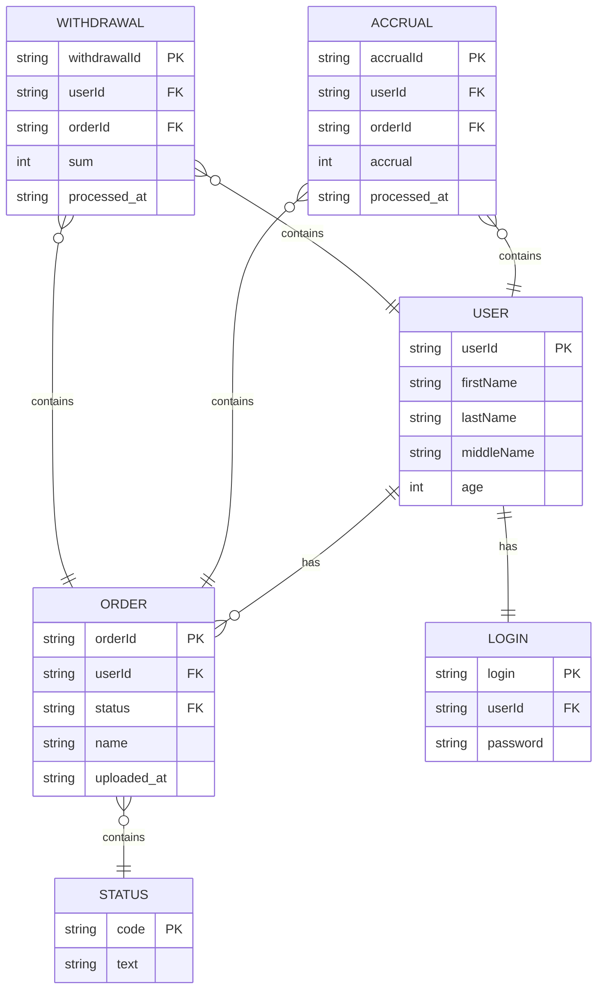

Гофермарт
===

[TOC]

## Описание основных сущностей и связей между ними ( ER-диаграмма)

## Список логических компонентов системы и схема из зависимостей друг от друга (общая архитектура решения)

## Две диаграммы последовательностей (sequence-диаграммы): для операции начисления балов - отразить взаимодействие с внешней системой), для операции снятия с баланса
