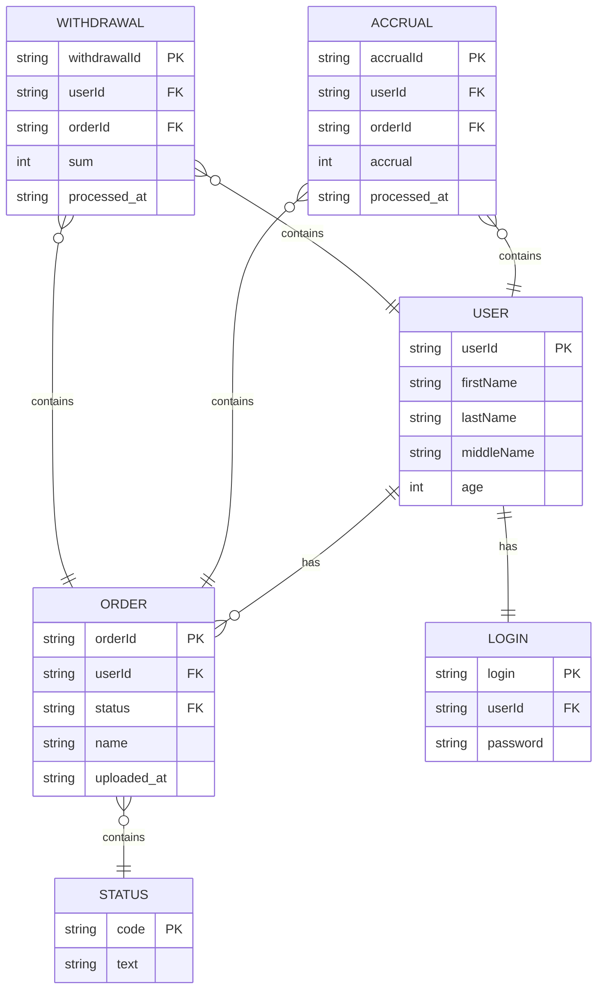

Гофермарт
===

[TOC]

## ER-диаграмма


## Sequence-диаграмма
```sequence
Alice->Bob: Hello Bob, how are you?
Note right of Bob: Bob thinks
Bob-->Alice: I am good thanks!
Note left of Alice: Alice responds
Alice->Bob: Where have you been?
```
